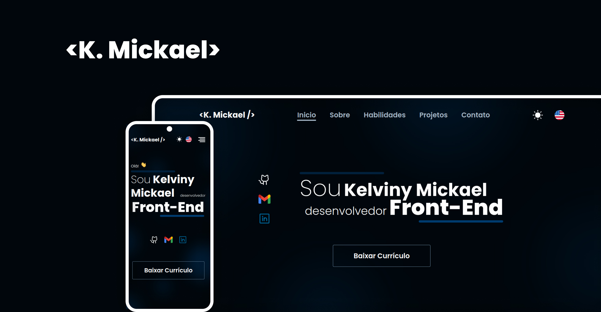

<h1 align="center">Projeto Portfólio | React JS</h1>

<h2 align="center">Sobre</h2>

Projeto do meu portfólio como desenvolvedor Front-End.</a>

 

  <a href="#-tecnologias">Tecnologias</a>&nbsp;&nbsp;&nbsp;|&nbsp;&nbsp;&nbsp;
  <a href="#-projeto">Projeto</a>&nbsp;&nbsp;&nbsp;|&nbsp;&nbsp;&nbsp;
  <a href="#memo-licença">Licença</a>

  

 

  

## 🚀 Tecnologias

Esse projeto foi desenvolvido com as seguintes tecnologias:

- ReactJS
- React Router Dom
- React Icons
- React Toastify
- React I18Next
- JSON Server
- EmailJS
- Figma (UI)

## 💻 Projeto

- [Visite o projeto online](kmickaeldev.netlify.app/)

## :memo: Licença

Esse projeto está sob a licença MIT.

---

Developed By Kelviny Mickael.
